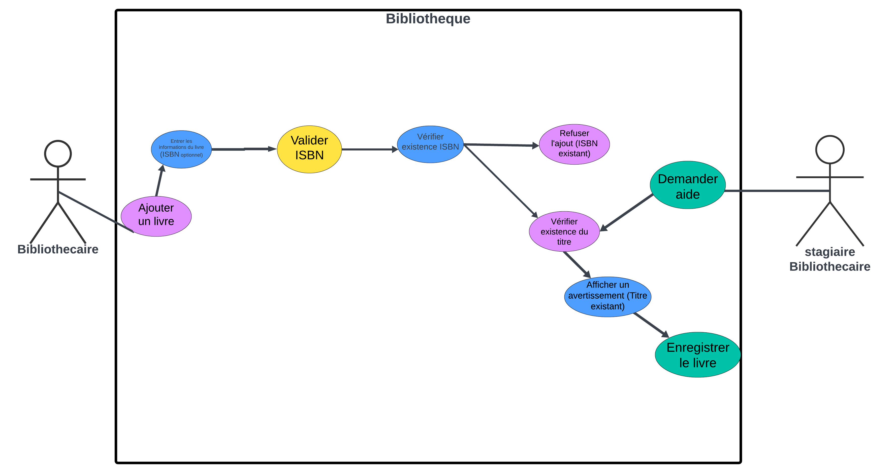

# travailPratique2
# Proposition Améliorée pour la Gestion de Livres dans la Bibliothèque

La bibliothèque gère un grand nombre de livres usagés, dont beaucoup ont été publiés avant 1972 et ne possèdent pas d'ISBN. L'objectif est de simplifier le processus d'ajout tout en assurant l'unicité des livres.

## Modifications Proposées

### Modification de la Base de Données (MongoDB)

- Ajout d'un champ supplémentaire dans la collection des livres pour stocker le titre comme identifiant unique lorsque l'ISBN n'est pas disponible.
- L'ajout de cette flexibilité permettra de gérer efficacement les livres publiés avant 1972 qui n'ont pas d'ISBN.

### Saisie des Détails du Livre

- Lors de l'ajout d'un livre, l'utilisateur saisit les informations nécessaires, telles que le titre, l'auteur, l'année de publication, etc.

### Frontend (Vue.js)

- Modification de l'interface utilisateur pour inclure un champ de saisie du titre en plus de celui de l'ISBN lors de l'ajout d'un livre.
- L'interface utilisateur doit rester intuitive, guidant l'utilisateur en fonction du scénario (ISBN ou titre).

### Vérification de l'Existence

- Le système vérifie si un livre similaire existe déjà dans la base de données en se basant sur le titre, l'auteur, et d'autres détails pertinents.

### Gestion des Livres sans ISBN

- Si l'année de publication est antérieure à 1972, l'ISBN ne sera pas obligatoire.
- Le système utilise le titre comme identifiant unique dans ce cas.

### Confirmation de l'Ajout

- Si un livre similaire est trouvé, le système informe l'utilisateur de l'existence du livre et propose de mettre à jour les informations existantes si nécessaire.
- Si aucun livre similaire n'est trouvé, le système ajoute le nouveau livre à la base de données.

### Backend (Express.js)

- Modification des routes et des contrôleurs pour gérer les deux scénarios : ajout de livre avec ISBN et ajout de livre sans ISBN.
- Implémentation d'une logique de vérification pour s'assurer que l'ISBN est valide, s'il est fourni, et que le titre est unique s'il est utilisé comme identifiant.
- Gestion appropriée des erreurs, avec des messages clairs pour guider l'utilisateur en cas de problème.

### Validation de l'ISBN

- Utilisation d'une bibliothèque de validation d'ISBN pour garantir la conformité aux normes des ISBN fournis.
- Affichage d'un message d'erreur si l'ISBN n'est pas valide, incitant l'utilisateur à vérifier et à corriger les informations.

### Tests et Documentation

- Mise en place de tests unitaires et d'intégration pour garantir le bon fonctionnement du système.
- Mise à jour de la documentation pour inclure les nouvelles fonctionnalités et les changements apportés au système.

Le diagramme de séquence ci-dessous illustre le processus d'ajout de livre, en montrant les différentes étapes et décisions prises par le système.

``` mermaid
sequenceDiagram
    Utilisateur->>Système: Entrée ISBN (optionnel), Titre, Auteur, Année, etc.
    Système->>Système: Valider ISBN
    Note right of Système: Si l'ISBN est valide,
    Système->>Système: Vérifier existence ISBN
    Note right of Système: Si l'ISBN existe, refuser l'ajout.
    Système->>Système: Si l'ISBN n'existe pas,\n vérifier titre (si pas d'ISBN)
    Note right of Système: Si le titre existe,\n afficher avertissement.
    Système->>Base de Données: Enregistrer le livre
    Système->>Utilisateur: Confirmation d'ajout
  
```
Diagramme de Cas d'Utilisation
Le diagramme de cas d'utilisation ci-dessous présente les différentes 
actions qu'un utilisateur peut effectuer lors de l'ajout d'un livre.

